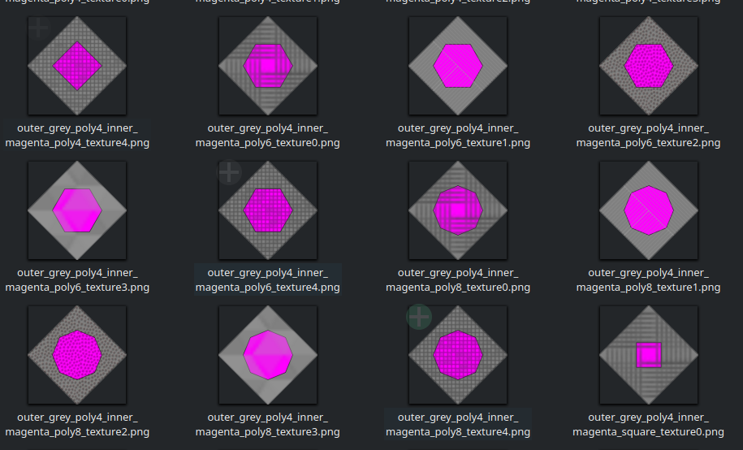
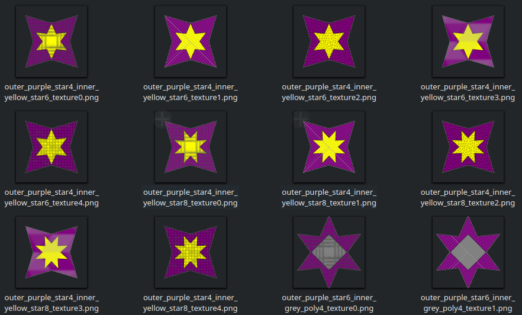
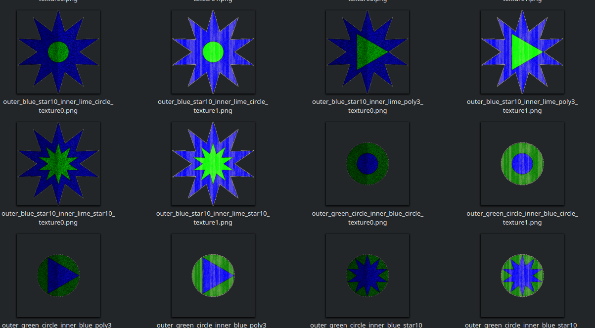

# polygon-dataset


## Setup
Clone the repo and install the dependencies.
```
git clone git@github.com:mfrashad/polygon-dataset.git
cd polygon-dataset
```
```
npm install
```

## Generate Polygon Dataset
Run the main script with node
```
node app.js
```

Change the variable in `app.js` if needed.
## Documentation
Specify the normal and anomaly shapes, colors, and textures in `app.js`.

**Default Normal Params**

Normal shapes = ['square', 'poly4', 'star4', 'poly6', 'star6', 'poly8', 'star8'] (7 shapes)  
Normal colors = ['red', 'yellow', 'pink', 'grey', 'purple', 'magenta', 'aqua] (7 colors)  
Normal textures = [
  'textures/woven.png',
  'textures/diagonal-striped-brick.png',
  'textures/basketball.png',
  'textures/vaio.png',
  'textures/3px-tile.png'
] (5 textures)

**Generated normal images**  
7 outer shapes * 7 inner shapes * 7 outer colors * 6 inner colors * 5 textures = 10290 images  
(6 inner colors because we don't want the same colors for both outer and inner color)

**Default Outliers Params**  
Outlier shapes = ['circle', 'star10', 'poly3] (3 shapes)  
Outlier colors = ['blue', 'green', 'lime] (3 colors)  
Outlier textures = ['textures/football-no-lines.png', 'textures/wood-pattern.png'] (2 texture)

**Generated outliers images**  
3 outer shapes * 3 inner shapes * 3 outer colors * 2 inner colors * 2 textures = 108 images 

**Total Images = 10398**


## Preview


